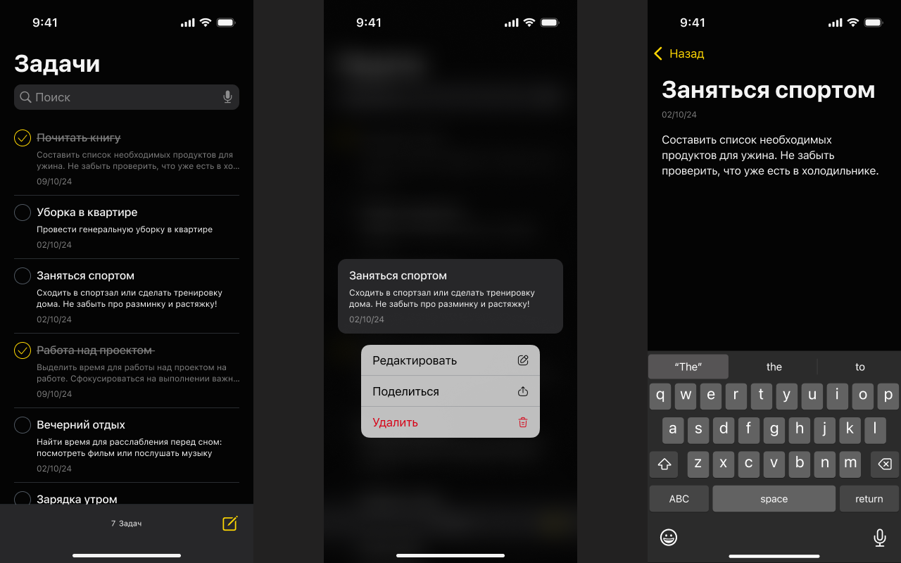

# EffectiveTodoApp

Приложение для ведения списка дел на iOS.

## Возможности

* Просмотр списка задач на главном экране
* Добавление, редактирование и удаление задач
* Поиск задач по названию
* Отображение статуса, описания и даты создания задачи
* Синхронизация при первом запуске: загрузка задач с [DummyJSON API](https://dummyjson.com/todos)

## Технологии и требования

* **Архитектура:** VIPER (View, Interactor, Presenter, Entity, Router)
* **Сохранение данных:** Core Data
* **Асинхронность:** GCD / NSOperation (UI не блокируется)
* **Xcode:** Поддержка Xcode 15
* **Git:** Используется система контроля версий
* **Тестирование:** Покрытие юнит-тестами основных компонентов
